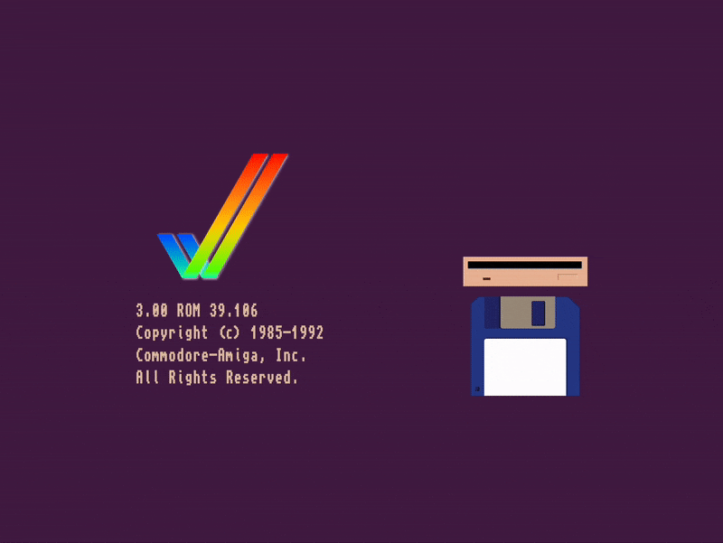

# Amiga Kickstart Bootscreen CSS

This is a pure CSS recreation of the Amiga 2.x onwards Kickstart Bootscreen. It
should work in all modern browsers. If it doesn't bug reports or even better
PRs are welcome.

## Why?

Because I couldn't sleep one night and started playing around in my favorite
code editor ;).

## Acknowledgements

The used (and bundled) TopazPlus font can be originally found here:
<https://github.com/rewtnull/amigafonts>. My thanks go out to the original
authors.
